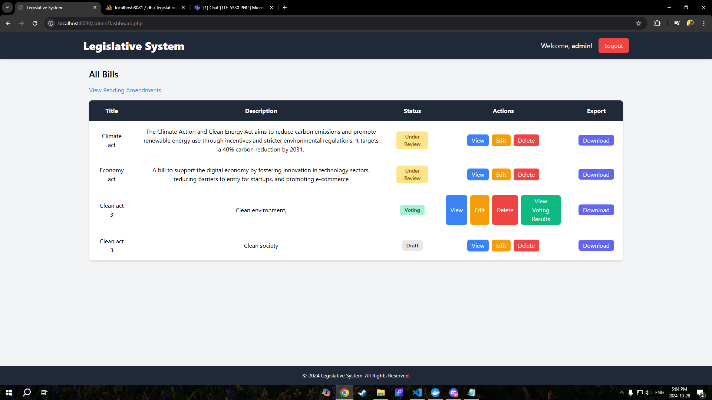
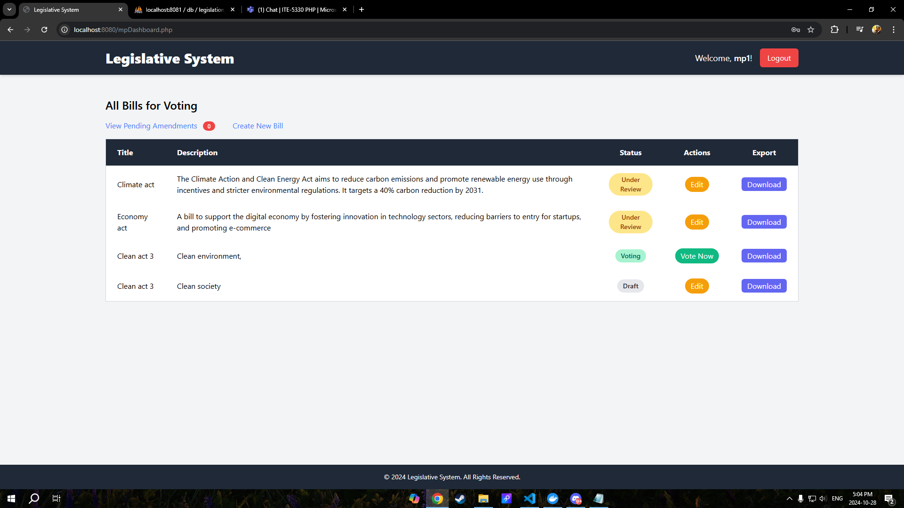
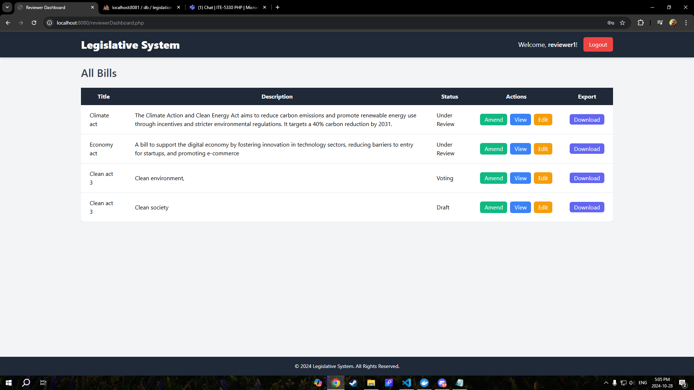
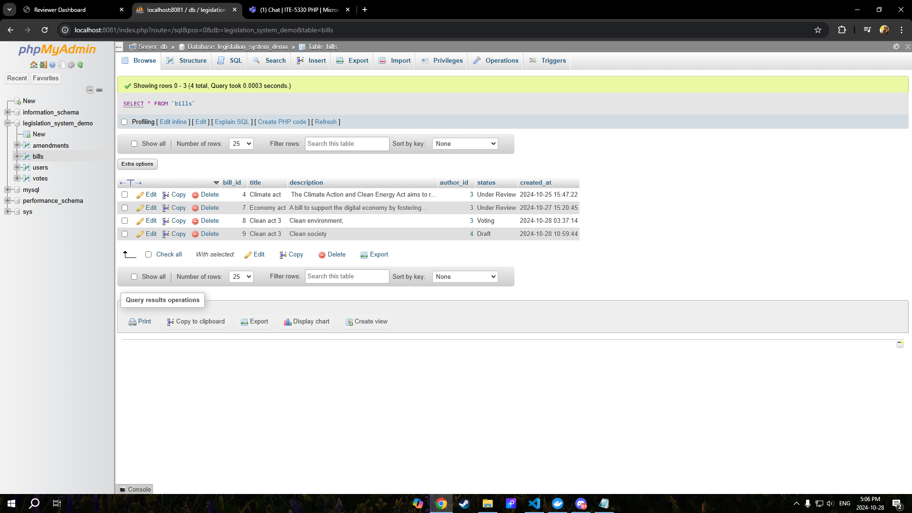
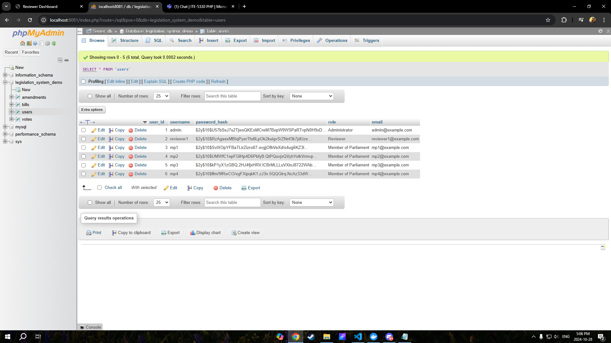
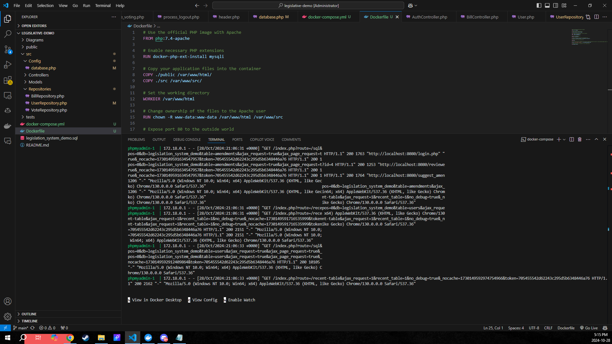
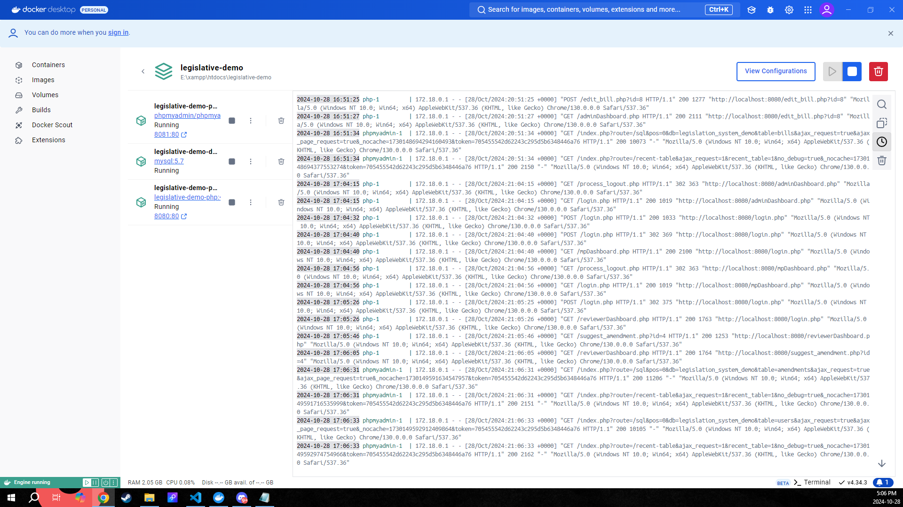
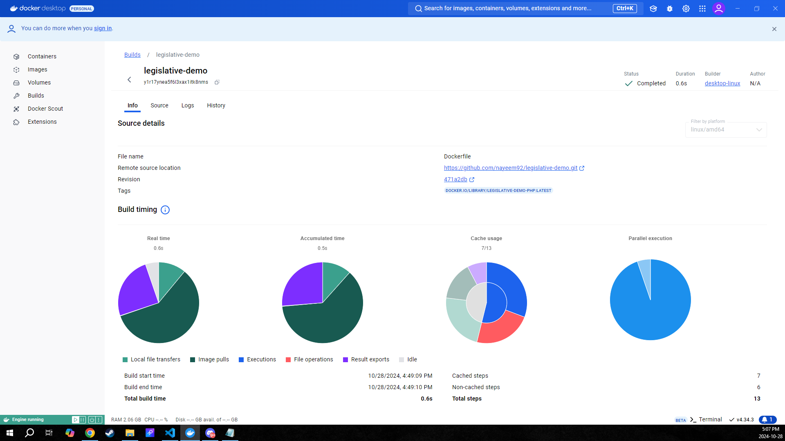
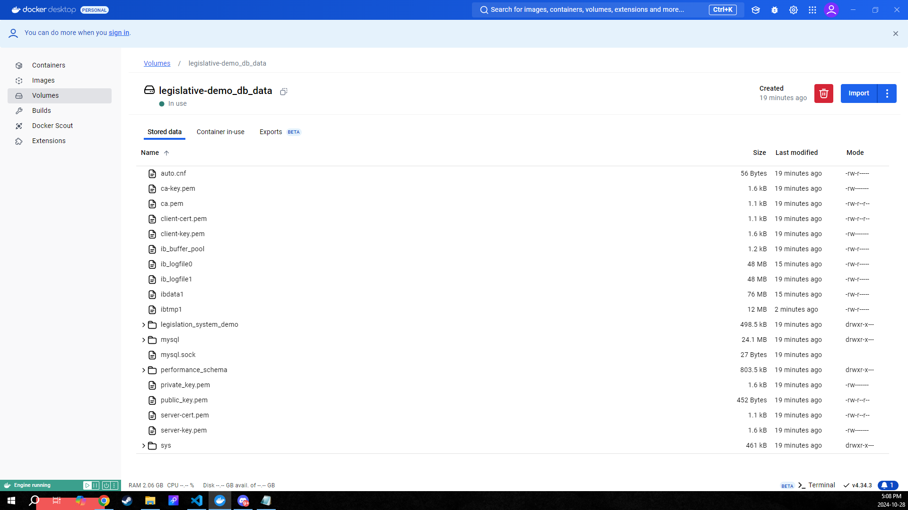

# Legislative System

The **Legislative System** is a web-based application designed to streamline the legislative process. The system allows different types of users — Members of Parliament (MPs), Administrators, and Reviewers — to interact with bills, including creating, editing, voting, reviewing, and managing legislative data. The system includes robust features like data export and status tracking for better governance.

## Project Description

This project aims to provide an intuitive interface for managing legislative processes, with features that support the needs of different roles:

- **Members of Parliament (MPs)** can:
  - Create new bills.
  - Edit and update bills.
  - Vote on bills that are under the voting stage.
  - Download bill data in XML or JSON format.

- **Administrators** can:
  - Manage all the bills created in the system.
  - View and delete bills.
  - See detailed voting results for each bill.
  - Export bill data to XML or JSON format.

- **Reviewers** can:
  - Review and amend bills.
  - Track the status of bills.

## Key Features

- **Role-Based Dashboards**:
  - Tailored dashboards for MPs, Admins, and Reviewers.
  - Clear navigation and action buttons for different tasks.
- **Bill Management**:
  - CRUD (Create, Read, Update, Delete) operations for bills.
  - Role-specific functionalities.
- **Voting**:
  - MPs can vote on bills.
  - Voting results are displayed in a user-friendly format.
- **Data Export**:
  - Bills can be exported in XML or JSON format for archival purposes.
- **Amendment Review**:
  - A streamlined process for reviewers to manage and track amendments.

## Technologies Used

- **PHP**: Server-side scripting for handling backend logic.
- **MySQL**: Relational database to store legislative data and user information.
- **Tailwind CSS**: A modern utility-first CSS framework for styling.
- **JavaScript**: Used for client-side interactions.
- **Composer**: Dependency management for PHP.

## Prerequisites

- **PHP** 8.2 or above.
- **MySQL Database**.
- **Apache Web Server** (XAMPP or similar).
- **Composer** for dependency management.

## Installation

### Option 1: Docker Setup

#### Step 1: Clone the Repository
```bash
git clone https://github.com/nayeem92/legislative-demo.git
cd legislative-demo
```

#### Step 2: Run Docker

- Ensure Docker is running on your system.
- Start the Docker containers:
  ```bash
  docker-compose up -d
  ```

#### Step 3: Access the Application

- Open your browser and navigate to [http://localhost:8080](http://localhost:8080).

#### Screenshot Reference






#### Step 3: Access phpMyAdmin

- Open your browser and navigate to [http://localhost:8081](http://localhost:8081).


#### Screenshot Reference





#### Database Configuration:
- In the Docker environment, set `DB_HOST` to `db` in `database.php` to connect to the MySQL container.

### Option 2: Local XAMPP/WAMP Setup

#### Step 1: Clone the Repository
```bash
git clone https://github.com/nayeem92/legislative-demo.git
cd legislative-demo
```

#### Step 2: Install Dependencies
```bash
composer install
```

#### Step 3: Database Setup

- Open PHPMyAdmin (usually at [http://localhost/phpmyadmin](http://localhost/phpmyadmin)) and create a new database named `legislation_system_demo`.
- Import the `legislation_system_demo.sql` file to set up initial tables and data.

#### Step 4: Run the Application

- Start XAMPP/WAMP and ensure Apache and MySQL are running.
- Open your browser and go to [http://localhost/legislative-system/public](http://localhost/legislative-system/public) (assuming the `legislative-system` folder is in your `htdocs` directory).

#### Database Configuration:
- When using XAMPP/WAMP, set `DB_HOST` to `localhost` in `database.php`.

## User Credentials

Below are the default usernames and passwords for testing the system:

### Members of Parliament (MPs)
- **MP1**:
  - Username: `mp1`
  - Password: `mp1_password`
- **MP2**:
  - Username: `mp2`
  - Password: `mp2_password`
- **MP3**:
  - Username: `mp3`
  - Password: `mp3_password`
- **MP4**:
  - Username: `mp4`
  - Password: `mp4_password`

### Administrator
- **Admin**:
  - Username: `admin`
  - Password: `admin_password`

### Reviewer
- **Reviewer1**:
  - Username: `reviewer1`
  - Password: `reviewer_password`


## Docker Desktop






